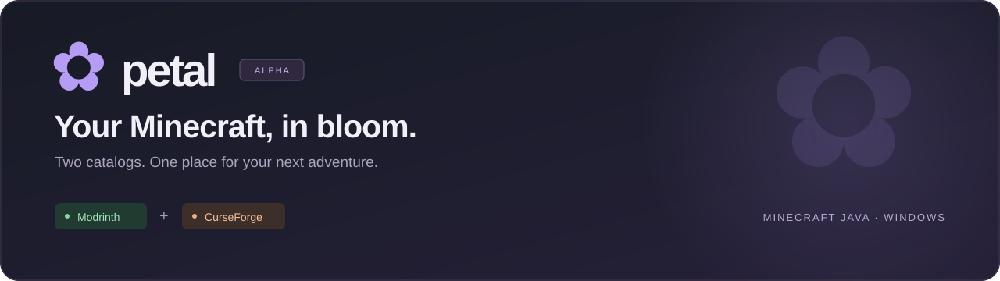
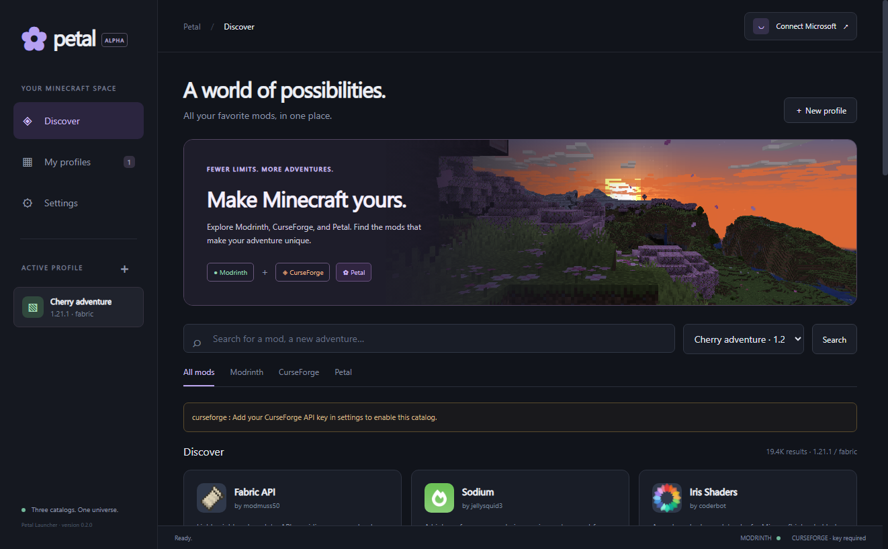
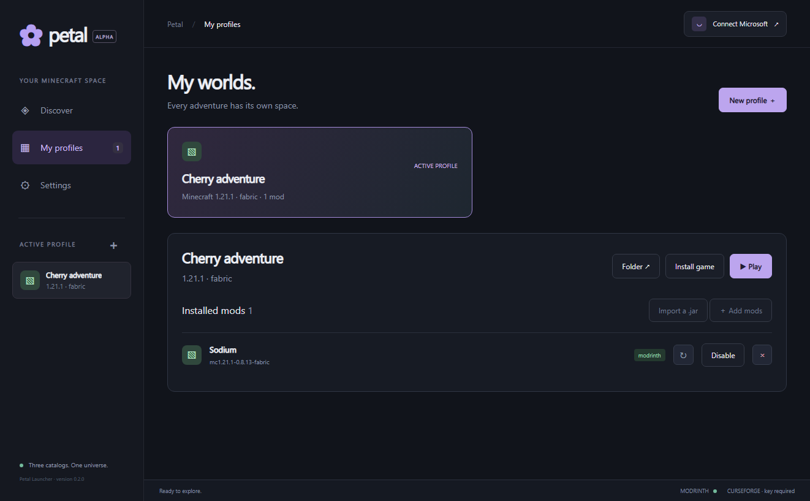

<p align="center">
  
</p>

<p align="center">
  <strong>A Minecraft Java launcher with room for every adventure.</strong><br>
  Discover mods, build separate worlds, and manage your instances from one desktop app.
</p>

<p align="center">
  
  
  
  <a href="LICENSE"></a>
</p>

<p align="center">
  <a href="#a-look-inside">Screenshots</a> ·
  <a href="#start-growing">Get started</a> ·
  <a href="docs/SETUP.md">Setup guide</a> ·
  <a href="https://github.com/P1kaCat/Petal/issues">Propose an idea</a> ·
  <a href="CONTRIBUTING.md">Contribute</a>
</p>

---

## A little space for a bigger world

Petal brings **Modrinth, CurseForge, and its own Petal catalog** into a shared discovery interface,
while keeping each platform's projects and identifiers distinct. Create a
profile, choose your Minecraft version and mod loader, and find mods that fit.

The Windows alpha uses a dark interface, a violet flower identity, and a real
Minecraft cherry-grove panorama. **The app interface and repository documentation are in English.**

> **Development preview · v0.2.0**
> Modrinth installation and Minecraft preparation have been exercised with real
> downloads. CurseForge requires an authorized API key. Microsoft sign-in needs
> an approved application registration. These two authenticated paths still need
> end-to-end verification. See [validation details](VERIFICATION.md).

## A look inside

### Discover your next adventure

Search by Minecraft version and loader, choose a catalog, and keep the selected
instance in view. The screenshot below is the actual alpha running with
Modrinth enabled; CurseForge is awaiting an API key.

<p align="center">
  
</p>

### Give every world its own space

Profiles keep saves, mods, and configuration separate. Manage installed mods,
prepare the game, or open an instance folder from the same screen.

<p align="center">
  
</p>

## Built around your instances

| Feature | What the alpha provides |
| :--- | :--- |
| **Three catalogs** | Modrinth, authorized CurseForge integration, and the configured Petal server. |
| **Petal hosting** | Own mod server, author accounts, private submissions, administrator review, and approved releases in the launcher. |
| **Separate profiles** | Dedicated folders for each instance's saves, mods, and configuration. |
| **Three mod loaders** | Automatic preparation for Fabric, Forge, and NeoForge. |
| **Minecraft + Java** | Game files and the required Java runtime downloaded from official services. |
| **Dependency handling** | Required dependencies, declared incompatibility checks, and file checksum verification. |
| **Mod management** | Install, enable, disable, remove, update, and manually import `.jar` files. |
| **Local credential storage** | Windows secure storage for the API key and refresh credentials; no bundled keys. |

## Start growing

Install **Node.js 24 or later**, **pnpm 11**, and Git, then run:

```powershell
git clone https://github.com/P1kaCat/Petal.git
cd Petal
pnpm install --frozen-lockfile
pnpm start
```

Create a profile, select a Minecraft version and loader, then search for mods.
Choose **Install game** in the profile view to prepare Minecraft and Java.
The first game preparation can download more than 1 GB.

To create the Windows portable executable:

```powershell
pnpm dist
```

The output is `dist/Petal 0.2.0.exe`. Compiled builds and installed dependencies
are not checked into this repository. This development executable is unsigned.

See the [setup guide](docs/SETUP.md) for CurseForge configuration, Microsoft
authentication, Java selection, data storage, and development checks.

## Where the alpha stands

### Give your mods a home

The **[Petal API & creator portal](api/README.md)** hosts mods on your own
server. Authors create accounts and submit releases; administrators review
them before publication. Published mods can be searched and installed through
the launcher's **Petal** tab, with dependency handling and SHA-512 verification.

Run the server locally with Node.js 24 or later:

```powershell
pnpm api
```

Open `http://127.0.0.1:4318` for the creator portal, then set that URL under
**Settings → Petal API** in the launcher. The [API guide](api/README.md)
documents author submission, moderation, endpoints, deployment, and preview limits.

**Implemented:** instance management, both catalog integrations, dependency-aware
mod installation, per-mod updates, loader preparation, and a Microsoft sign-in
flow that requires the project's own approved client ID.

**Still to verify:** authorized CurseForge requests and downloads, Microsoft
sign-in, and an authenticated Minecraft game session.

**Not implemented yet:** Modrinth `.mrpack` and CurseForge modpack import/export,
shader and resource-pack management, multiple accounts, and automatic recovery
from a process crash during file replacement.

Compatibility checks cover declared conflicts and file collisions; they cannot
guarantee that every combination of mods works together. Projects with matching
names across catalogs are not automatically treated as the same mod.

## Help Petal grow

Have a bug to report or a feature in mind? Open an
[issue](https://github.com/P1kaCat/Petal/issues/new/choose) in this repository.
Code and documentation changes are proposed through GitHub pull requests.
The maintainer reviews contributions before merging them.

Read [CONTRIBUTING.md](CONTRIBUTING.md) before preparing a change. Contribution
forks are for submitting improvements to Petal; they are not permission to
publish an independent release.

## License & credits

Petal is **source-available under the [Petal Restricted Source License](LICENSE)**.
Personal non-commercial use, local modifications, and the defined GitHub
contribution workflow are permitted. **Redistribution and republication,
including modified versions, require written permission**, subject to the
GitHub-hosting exception and applicable law described in the license.

Third-party libraries, Minecraft content, and mod artwork remain under their
owners' terms. See [third-party notices](THIRD_PARTY_NOTICES.md) and
[Minecraft panorama provenance](src/assets/SOURCES.md).

<p align="center">
  <sub>Created by <a href="https://github.com/P1kaCat">P1kaCat</a> · Independent Minecraft launcher · Not affiliated with Mojang, Microsoft, Modrinth, or CurseForge</sub>
</p>
