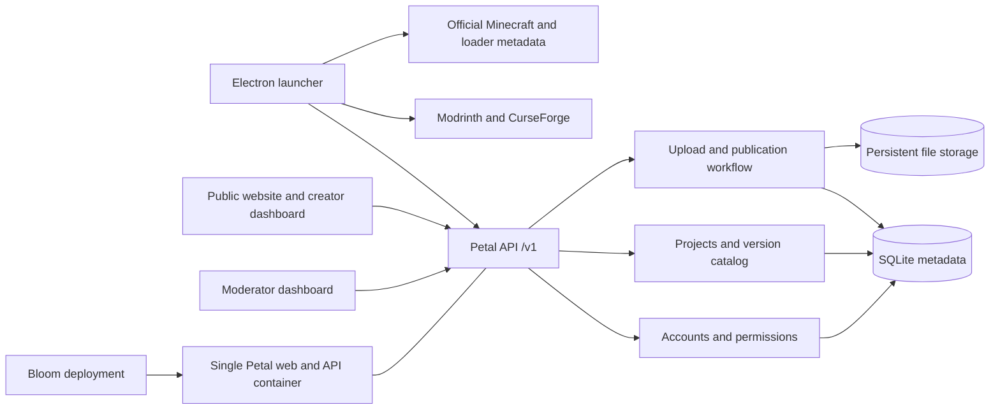

# Petal platform design

Date: 2026-10-05  
Status: Approved by the user on 2026-10-05; implementation plan review pending. This document does not claim implementation completion.
Scope: Minecraft Java launcher, mod platform, author accounts, website, API, and Bloom deployment compatibility.

## 1. Intent and constraints

Petal should grow into a coherent Minecraft platform: discover content from Modrinth, CurseForge, and Petal; install compatible content in isolated launcher profiles; and let authors host their own work on Petal after moderation. Modrinth is a product benchmark, not a claim of immediate feature, traffic, or operational parity.

Confirmed user requirements:

- A broad Minecraft version catalog and loader support.
- A public website, Petal accounts, author publishing, and an API.
- Authors submit their own content; approval precedes publication.
- Local operation first, followed by deployment, preferably using Bloom.
- English product UI, documentation, and GitHub presentation.
- Preserve the violet flower branding and use actual Minecraft imagery or genuine application captures. Do not generate illustrations with AI.
- Preserve the existing restricted repository license and GitHub contribution workflow. Hosted projects retain their authors' licenses.

Working assumptions: one operator, one initial server process, a persistent disk, and no purchased email or object-storage service yet. Production domain, mail provider, server capacity, and storage budget are configuration decisions, not invented credentials or promises.

## 2. Evidence and starting point

The Petal working tree already contains an Electron launcher with isolated profiles and Modrinth/CurseForge integrations, plus an uncommitted Node.js API preview. The preview has SQLite, author accounts with salted scrypt password hashes, expiring bearer sessions, private uploads, moderation, a creator portal, and a Petal catalog integration. It currently supports release-style Minecraft identifiers and Fabric, Forge, and NeoForge metadata. These restrictions must be removed deliberately.

The preview lacks account email verification/recovery, a complete public website, editable moderated project metadata, public operator authentication, and a verified Bloom deployment. The preview administrator token is suitable for local development, not the final public administration flow.

Bloom was inspected at commit `7bbd35c2f34794d16e60bee6735c647dd203e38f` from [P1kaCat/Bloom](https://github.com/P1kaCat/Bloom). Its current phase builds a public repository's root Dockerfile, requires exactly one exposed TCP port, and starts a container with no application volumes or custom runtime configuration. Its dashboard has no authentication or TLS and is intended for a trusted LAN. Therefore, merely moving Petal's Dockerfile to the root will not provide durable hosting.

## 3. Architecture and alternatives

Decision ADR-001: evolve the existing Node.js service into a modular application serving the website and API on the same origin and port. Keep the Electron launcher a separate application and package.

Alternatives considered:

| Option | Advantages | Costs | Decision |
| --- | --- | --- | --- |
| Modular application | One deployment, shared authorization, reuse existing work | Requires clear module boundaries; one initial process | Selected |
| Independent website and API | Independent deployment and scaling | Additional configuration, origins, and services | Revisit when necessary |
| Microservices | Independent subsystem scaling | Queues, distributed state, more operations and failure modes | Deferred |

Suggested boundaries within the existing repository: configuration and HTTP lifecycle, account/session services, permissions, project/version services, upload validation, moderation, search, storage, migrations, and website assets. Keep `src/` for the launcher and `api/` for the platform initially. Avoid a framework migration solely to increase the number of technologies.

## 4. Minecraft versions and loaders

Decision ADR-002: use provider metadata as the source of compatible versions; do not infer compatibility from a numeric version string.

- Read Minecraft Java versions from the official Mojang manifest. Preserve opaque version identifiers and their release, snapshot, old beta, and old alpha types.
- Offer category filters, searchable selectors, latest-version shortcuts, and a bounded metadata cache with an explicit refresh action. Show cached results with a stale indicator when a provider is unavailable.
- Validate requested versions against trusted metadata; use a separate generated profile directory identifier so unusual version names cannot become filesystem paths.
- Introduce a loader adapter contract covering discovery, supported game versions, install, runtime identity, and diagnostic failures.
- First adapters: Vanilla, Fabric, Forge, NeoForge, and Quilt. Allow explicit loader versions and prerelease opt-in. Vanilla profiles do not offer mod installation.
- Evaluate historical Forge, LiteLoader, and Rift as separate compatibility additions. A loader is selectable only after its installation path is implemented and tested. Shader mods and optimizers are not automatically treated as loaders.
- Keep Java requirements tied to version metadata, with documented overrides only for historical versions requiring special treatment.
- Installing or listing a version is not proof that Minecraft successfully launched. Publish separate discovery, installation, and launch verification status.

Official metadata references: [Minecraft manifest](https://piston-meta.mojang.com/mc/game/version_manifest_v2.json), [Fabric Meta](https://meta.fabricmc.net/), and [Quilt Meta](https://meta.quiltmc.org/). Forge and NeoForge adapters retain their authoritative release sources and must account for differences between legacy and current installers.

“All versions” means all versions available in the official manifest. Versions absent from that manifest are not invented or silently sourced from third-party archives. Bedrock distribution is outside this Java platform scope.

## 5. Website and content model

The public site provides discovery, paginated search, sorting, type/category filters, Minecraft/loader filters, project pages, version downloads, dependency details, author profiles, and real download counts. Unpublished material stays private. Failed providers and an empty Petal catalog receive honest empty/error states rather than fabricated content or statistics.

The creator dashboard provides project creation and editing, a preview, icon/gallery management, version submission, compatibility selection, dependencies, changelogs, and review history. Project membership roles distinguish owner, maintainer, and contributor. Only an owner can transfer ownership or change membership; ownership changes are audited.

Content types are phased: hosted mods first; resource packs, shaders, datapacks, and modpacks follow with type-specific validation and installation destinations. Modpacks require a defined manifest and dependency acquisition rules. External files cannot be repackaged or mirrored merely because they appear in another catalog.

Project fields include stable ID, unique slug, content type, title, summary, sanitized description, owner/team, license, source/issues links, categories, icon/gallery references, and publication state. Version fields include stable ID, label, changelog, release channel, supported game versions/loaders, dependencies, file metadata/checksums, review state, and timestamps. Published file bytes are immutable.

Decision ADR-003: publish revisions rather than allowing edits to bypass review. A changed public description, icon, gallery, license, or file receives a pending revision while the previously approved revision stays public. Approval replaces the public revision atomically; rejection preserves the existing public version. Ordinary typo edits can later receive a documented moderation policy, but are not an implicit bypass.

The design keeps Petal's flower and violet identity, with English copy, keyboard navigation, visible focus, accessible labels, and layouts verified at desktop and mobile widths. Uploaded HTML/SVG and Markdown are not trusted executable content. Raster images are validated and re-encoded before public serving.

## 6. Accounts and authorization

Petal identity is separate from Microsoft Minecraft ownership. Public browsing/downloads do not require a Petal account. Publishing requires an authenticated author account and, for public service operation, a verified email.

- Accounts support signup, login, logout, session revocation, profile editing, email verification, and password reset. Recovery tokens are random, hashed at rest, short lived, and single use. Recovery responses avoid revealing whether an account exists.
- Keep existing scrypt credentials valid. Record credential parameters so a future algorithm/work-factor migration can rehash on successful login rather than lock out existing authors.
- Website sessions move to secure HTTP-only cookies for HTTPS deployments, with explicit CSRF protection and origin checks. Local development has a clearly scoped loopback configuration. Transition existing bearer portal sessions with a documented compatibility window.
- Launcher/API access uses revocable, scoped bearer tokens. Never embed operator tokens in the Electron app or website bundle. Account passwords and tokens are excluded from logs.
- Roles: user, author, moderator, administrator. Role assignment is privileged and audited. Moderators review content; administrators manage access and server settings. Require MFA for public moderator/administrator accounts.
- The local bootstrap creates the first administrator through an operator-only, single-use flow. Disable the development master-token flow in public mode after migration.
- An email adapter supports local development delivery and a real SMTP/provider configuration. Local mail previews remain operator-only and outside Git. Public publishing/recovery remains disabled until real mail delivery is configured and verified.

OAuth provider login, paid memberships, and payment handling are later features rather than prerequisites for the first complete publishing flow.

## 7. Uploads, review, and storage

Lifecycle: draft → uploading/validation → pending → published or rejected. Rejected material can be revised and resubmitted; published releases can be withdrawn. Visibility and download authorization derive from publication state, not possession of a file URL.

Retain checksum verification, safe generated storage keys, bounded streaming uploads, archive-path validation, expanded-size limits, concurrency limits, and declared distribution permission. Add per-user quotas, request limits, cleanup of abandoned drafts/temporary files, and explicit reservation/release of upload capacity to avoid concurrent quota bypasses.

Archive structure validation does not establish that a mod is safe. Files stay quarantined until validation and moderation complete. A public operator must configure the malware scan/review policy; scanner failures leave the submission pending and never auto-publish it. Do not execute uploaded mods on the platform server.

Decision ADR-004: use SQLite and persistent local files for the first single-process deployment, behind database and storage interfaces. SQLite uses versioned, transactional migrations and its backup API; copying only a live database file is not an acceptable backup. PostgreSQL and S3-compatible storage become later adapters with explicit migration/verification tooling. A single SQLite deployment cannot claim horizontal multi-writer support.

Backups include a consistent database snapshot, referenced immutable files, required configuration, and protected operator secrets. Restore into an isolated instance and verify project visibility, authentication, file hashes, and downloads before declaring backup support complete. Deletions use a retention period and cannot remove a file still referenced by a retained public revision.

## 8. API contract and launcher compatibility

Maintain `/v1` as the API namespace and preserve currently consumed project/version/download response fields. Add an OpenAPI 3.1 contract with examples, permissions, validation errors, and rate limits. Use consistent camelCase field names.

Resource groups: Minecraft versions/loaders, accounts/sessions, users, projects/members/revisions, versions/files/dependencies, reports, moderation decisions, and scoped API tokens. All collection endpoints are bounded and paginated. Search retains offset/limit compatibility; new collections can use stable cursor pagination. Existing clients receive a documented transition before breaking contracts.

Use consistent problem-details responses with public error codes; never expose stack traces or database details. Add structured request IDs and health/readiness endpoints. Readiness verifies required storage/database availability without exposing secrets.

The launcher retains provider-specific project IDs and permissions. Petal dependencies initially resolve within Petal; cross-provider dependencies require explicit source identifiers and permission-aware resolvers. Hash validation, staging, rollback, and profile isolation remain mandatory. Provider failures preserve other sources' results. CurseForge download behavior must be checked against the authenticated API contract as part of regression work.

## 9. Bloom deployment contract

Decision ADR-005: deploy the website and API as one Petal container, with a root Dockerfile, one exposed TCP port, a non-root runtime user, `0.0.0.0` listening, and an HTTP readiness health check. Keep the desktop application out of that image. Persistent data must not be baked into the image.

Minimum Bloom additions required for a durable local/LAN deployment:

1. Per-project persistent storage, isolated by generated project IDs and mounted only at declared application data paths. No arbitrary host-path mounting. Storage survives container replacement; deleting it requires a distinct explicit operation.
2. Validated per-project runtime configuration for origin, storage path, mail settings, and limits. Sensitive values use protected secret references and are redacted from logs/API responses; do not commit them or expose them to unrelated applications.
3. Defined stopped-container replacement/retry behavior that preserves storage and configuration. Provide a backup and rollback procedure; migrations must not make image rollback falsely appear safe.
4. Permission/ownership handling for Petal's non-root user, with no world-writable workaround.

For internet-facing operation, additionally require HTTPS routing and trustworthy origin/proxy configuration, plus operator authentication/access control for Bloom itself. Keep Bloom's Docker control interface private. These are infrastructure dependencies for public hosting, not capabilities already implemented by Bloom.

Initially use Docker Compose as an independent validation path for Petal. Compose success does not prove Bloom integration. Verify Bloom with a real container on the intended Linux host, including replacement and restoration. Docker is not currently available in the Petal Windows workspace, so container execution remains an explicit validation dependency.

## 10. Reliability, operations, and verification

- Metadata provider outage: bounded timeout/retry, cache fallback, visible stale/error state, no false compatible loader choice.
- Interrupted upload or full disk: no published partial file, quota reservation released, temp cleanup and useful author feedback.
- Failed review transaction: public revision remains consistent with the downloadable file.
- Session revocation or role removal: authorization is checked again on each protected operation.
- Scanner/mail outage: actionable operator status; no successful publication/verification claims.
- Container replacement: data and settings preserved; health check detects failed migration/storage startup.
- Backups: automated schedule configured by the operator, retention limits, and a demonstrated restore. Target a daily backup initially; this is an operating target, not an already achieved guarantee.

Bounded searches, file streaming, upload quotas, and retention are required before public deployment. Measure search latency and resource use on the chosen server; establish a capacity envelope before advertising performance. Hosting cost depends on storage, download bandwidth, backup retention, email, and compute. No zero-cost or Modrinth-scale guarantee is assumed.

Acceptance matrix:

| Area | Required evidence |
| --- | --- |
| Minecraft catalog | All four manifest categories, unusual IDs, cache behavior, and safe profile paths |
| Loaders | Provider compatibility checks plus successful installation for representative supported game versions; launch checks reported separately |
| Accounts | Signup, email verification, login/logout, reset expiry/reuse rejection, session revocation, privilege denial, and privileged MFA |
| Publication | Private pending content, immutable files, revision approval/rejection, withdrawal, and audit history |
| Website | Genuine public/author/moderator flows; desktop/mobile and keyboard checks; no synthetic production records |
| API and launcher | Contract validation, pagination, permission failures, checksums, dependency installation, rollback, and provider outage behavior |
| Deployment | Container health, persistent data across replacement, correct public origin, and secret redaction |
| Recovery | Restore into an isolated instance with verified file hashes and readable metadata |

## 11. Delivery order and boundaries

These are product milestones, not the written implementation plan:

1. Complete and preserve the existing API preview baseline; expand the version catalog and loader adapters.
2. Deliver public discovery and project pages, accounts, and the author dashboard using the shared API.
3. Complete moderated revisions, memberships, reports, account recovery, audit events, and operational safeguards.
4. Validate standalone container deployment, then implement the required Bloom persistence/configuration capabilities and verify them on Linux.
5. Extend hosted content types and modpack installation; add community features such as follows, collections, and notifications after the publishing foundation works.

Exact Modrinth feature parity, revenue sharing, global CDN operation, billing, multi-node orchestration, and support for every historical unofficial loader are not completion claims for the first platform release. They remain possible later extensions with separate requirements and evidence.

## 12. Review and handoff

The conversational architecture proposal was accepted for specification drafting. This written specification now requires user review. After approval, prepare the implementation plan with ordered repository changes, checks, delivery checkpoints, and the selected execution method. Do not treat this document as approval of an implementation plan that has not yet been presented.
